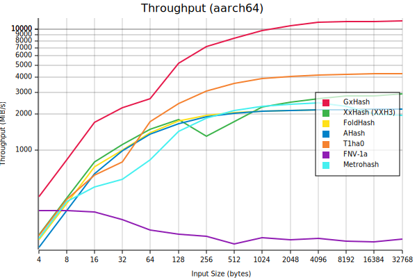
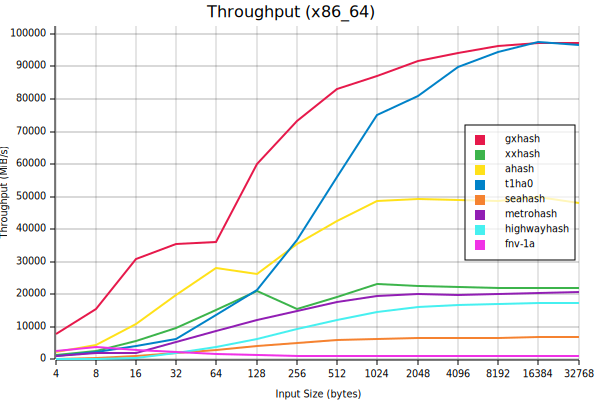

# GxHash
[](https://github.com/ogxd/gxhash/actions/workflows/build_test.yml)
[](https://github.com/ogxd/gxhash/actions/workflows/cross_compile.yml)
[](https://github.com/ogxd/gxhash/actions/workflows/rust_version.yml)

GxHash is a [**blazingly fast**](#performance) and [**robust**](#robustness) non-cryptographic hashing algorithm.

**[Features](#features) | [Considerations](#important-considerations) | [Usage](#usage) | [Benchmarks](#benchmarks) | [Contributing](#contributing)**

## Features

### Blazingly Fast 🚀  
Up to this date, GxHash is the fastest non-cryptographic hashing algorithm of its class, for all input sizes. This performance is possible mostly thanks to heavy usage of SIMD intrinsics, high ILP construction, a small bytecode (easily inlined and cached) and some ([outrageously unsafe](https://ogxd.github.io/articles/unsafe-read-beyond-of-death/)) tricks.  

See the [benchmarks](#benchmarks).

### Highly Robust 🗿  
GxHash uses several rounds of hardware-accelerated AES block cipher for efficient bit mixing.  
Thanks to this, GxHash passes all [SMHasher](https://github.com/rurban/smhasher) tests, which is the de facto quality benchmark for non-cryptographic hash functions, gathering most of the existing algorithms. GxHash has low collisions, uniform distribution and high avalanche properties.

Check out the [paper](https://github.com/ogxd/gxhash-rust/blob/main/article/article.pdf) for more technical details.

### 0 Dependencies 📦
GxHash has 0 cargo dependency. The `Hasher` and `Hashset`/`Hashmap` convenience types require the standard library, enabled by default with the `std` feature.

## Important Considerations

### Hardware Acceleration
GxHash requires a few specific hardware acceleration features, which are supported on *most* modern processors, but not all of them.
- X86 processors with `AES-NI` & `SSE2` intrinsics
- ARM processors with `AES` & `NEON` intrinsics
> **Warning**
> Other platforms are currently not supported (there is no fallback). GxHash will not build on these platforms.

In case you are building gxhash without the required features, the crate will fail to build with an error message like this (even if you know your target supports the required features): 
```
Gxhash requires aes and sse2 intrinsics. Make sure the processor supports it and build with RUSTFLAGS="-C target-cpu=native" or RUSTFLAGS="-C target-feature=+aes,+sse2"
```

To fix this, simply follow the instructions in the error message. Setting `RUSTFLAGS` to `-C target-cpu=native` should work if your CPU is properly recognized by rustc, which is the case most of the time.

### Hashes Stability
All generated hashes for a given major version of GxHash are stable, meaning that for a given input the output hash will be the same across all supported platforms. This also means that the hash may change between majors versions (eg gxhash 2.x and 3.x).

### Consistency of Hashes When Using the `Hasher` Trait
The `Hasher` trait defines methods to hash specific types. This allows the implementation to circumvent some tricks used when the size is unknown. For this reason, hashing 4 `u32` using a `Hasher` will return a different hash compared to using the  `gxhash128` method directly with these same 4 `u32` but represented as 16 `u8`. The rationale being that `Hasher` (mostly used for things like `HashMap` or `HashSet`) and  `gxhash128` are used in two different scenarios. Both way are independently stable still. 

### Unsafety
In order to achieve this magnitude of performance, this crate contains unsafe code as well as [a rather aggressive optimization technique](https://ogxd.github.io/articles/unsafe-read-beyond-of-death/). For this reason, this crate is not intended for use in safety-critical applications, but rather for applications that require extreme hashing performance and that are less concerned about this aspect.

### Security
GxHash is seeded (with seed randomization) to improve DOS resistance and uses a wide (128-bit) internal state to improve multicollision resistance. Yet, such resistances are just basic safeguards and do not make GxHash secure against all attacks.

For use cases that require deterministic repeatability, you can disable random seeding with the feature 
"deterministic," but this of course disables DOS mitigation. 

Also, it is important to note that GxHash is not a cryptographic hash function and should not be used for cryptographic purposes.

## Usage
```bash
cargo add gxhash
```
Used directly as a hash function:
```rust
let bytes: &[u8] = "hello world".as_bytes();
let seed = 1234;
println!(" 32-bit hash: {:x}", gxhash::gxhash32(&bytes, seed));
println!(" 64-bit hash: {:x}", gxhash::gxhash64(&bytes, seed));
println!("128-bit hash: {:x}", gxhash::gxhash128(&bytes, seed));
```

GxHash provides an implementation of the [`Hasher`](core::hash::Hasher) trait.
For convenience, this crate also provides the type aliases `gxhash::HashMap` and `gxhash::HashSet`.

```rust
use gxhash::{HashMap, HashMapExt};

let mut map: HashMap<&str, i32> = HashMap::new();
map.insert("answer", 42);
```

## Flags

### `no_std`

The `std` feature flag enables the `HashMap`/`HashSet` container convenience type aliases. This is on by default. Disable to make the crate `no_std`:

```toml
[dependencies.gxhash]
...
default-features = false
```

### `hybrid` (experimental)

The `hybrid` feature flag enables a hybrid implementation of GxHash. This is disabled by default. When `hybrid` feature is enabled and for CPUs that supports it, GxHash will use wider registers and instructions (`VAES` + `AVX2`), which can lead to a throughput increase for large inputs. This preserves hashes stability, meaning that hashes generated with or without the `hybrid` feature are the same for a given input and seed.

*Note: Even without this feature enabled GxHash is already the fastest option out there. We recommend enabling this feature only when inputs can be larger than a few hundred bytes. Make sure to run benchmarks in your own context.*

## Benchmarks

[](https://github.com/ogxd/gxhash/actions/workflows/bench.yml)  
GxHash is continuously benchmarked on X86 and ARM GitHub runners.  

Important: If performance if a critical feature for your application, don't forget to benchmark the cost of hashing in your own context. Numbers shared here may be radically different in your environment and with your hardware.  

To run the benchmarks locally use one of the following:
```bash
# Benchmark throughput
# Add --features bench-md for markdown output or --features bench-plot for .svg plots
cargo bench --bench throughput

# Benchmark performance of GxHash's Hasher when used in a HashSet
cargo bench --bench hashset
```

### Throughput

Throughput is measured as the number of bytes hashed per second.

*Some prefer talking of **latency** (time for generating a hash) or **hashrate** (the number of hashes generated per second) for measuring hash function performance, but those are all equivalent in the end as they all boil down to measuring the time it takes to hash some input and then apply different scalar transformation. For instance, if latency for a `4 bytes` hash is `1 ms`, then the throughput is `1 / 0.001 * 4 = 4000 bytes per second`. Throughput allows us to conveniently compare the performance of a hash function for any input size on a single graph.*

The `throughput` benchmark is custom (it does not rely on criterion.rs). In an attempt of reducing biais in this microbenchmark as much as possible, it shuffles seeds, input data, and alignment. It also has the benefit of being less of a "black box" compared to criterion. There is however a criterion-based throughput benchmark named `throughput_criterion` if you prefer. Results vary slightly between the two benchmarks, don't hesitate to submit an issue if you suspect biais and want to suggest improvements.

**Latest Benchmark Results:**    



## Contributing

- Feel free to submit PRs
- Repository is entirely usable via `cargo` commands
- Versioning is the following
  - Major for stability breaking changes (output hashes for a same input are different after changes)
  - Minor for API changes/removal
  - Patch for new APIs, bug fixes and performance improvements

#### Useful profiling tools
- [cargo-show-asm](https://github.com/pacak/cargo-show-asm) is an easy way to view the actual generated assembly code. You can use the hello_world example to view the isolated, unoptimized byte code for gxhash. A few useful commands:
  - Line by line generated asm: `cargo asm --rust --simplify --example hello_world hello_world::gxhash`
  - Generated llvm: `cargo asm --llvm --example hello_world hello_world::gxhash`
  - Count of assembly instructions: `cargo asm --simplify --example hello_world hello_world::gxhash | grep -v '^\.' | wc -l`
    - Powershell version: `cargo asm --simplify --example hello_world hello_world::gxhash | where { !$_.StartsWith(".") } | measure -Line`
- [AMD μProf](https://www.amd.com/en/developer/uprof.html) gives some useful insights on time spent per instruction.

## Publication
> Author note:
> I'm committed to the open dissemination of scientific knowledge. In an era where access to information is more democratized than ever, I believe that science should be freely available to all – both for consumption and contribution. Traditional scientific journals often involve significant financial costs, which can introduce biases and can shift the focus from purely scientific endeavors to what is currently trendy. 
>
> To counter this trend and to uphold the true spirit of research, I have chosen to share my work on "gxhash" directly on GitHub, ensuring that it's openly accessible to anyone interested. Additionally, the use of a free Zenodo DOI ensures that this research is citable and can be referenced in other works, just as traditional publications are. 
>
> I strongly believe in a world where science is not behind paywalls, and I am in for a more inclusive, unbiased, and open scientific community.

Publication:  
[PDF](https://github.com/ogxd/gxhash-rust/blob/main/article/article.pdf)

Cite this publication / algorithm:  
[](https://zenodo.org/badge/latestdoi/690754256)
