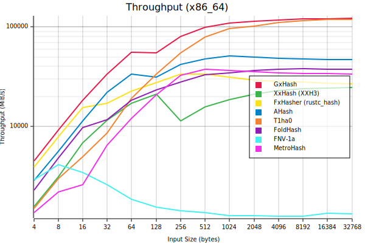
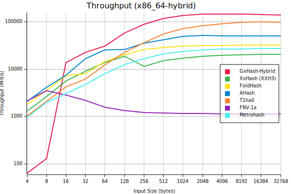

# GxHash
[](https://github.com/ogxd/gxhash/actions/workflows/build_test.yml)

GxHash is a [**blazingly fast**](#performance) and [**robust**](#robustness) non-cryptographic hashing algorithm.

## Usage
```bash
cargo add gxhash
```
Used directly as a hash function:
```rust
let bytes: &[u8] = "hello world".as_bytes();
let seed = 1234;
println!(" 32-bit hash: {:x}", gxhash::gxhash32(&bytes, seed));
println!(" 64-bit hash: {:x}", gxhash::gxhash64(&bytes, seed));
println!("128-bit hash: {:x}", gxhash::gxhash128(&bytes, seed));
```
Used in `HashMap`/`HashSet`:
```rust
// Type alias for HashSet::<String, GxBuildHasher>
let mut hashset = gxhash::GxHashSet::default();
hashset.insert("hello world");
```

## Features

### Blazingly Fast 🚀  
Up to this date, GxHash is the fastest non-cryptographic hashing algorithm of its class, for all input sizes. This performance is possible mostly thanks to heavy usage of SIMD intrinsics, high ILP construction and a small bytecode (easily inlined and cached).  
See the [benchmarks](#benchmarks).

### Highly Robust 🗿  
GxHash uses several rounds of hardware-accelerated AES block cipher for efficient bit mixing.  
Thanks to this, GxHash passes all [SMHasher](https://github.com/rurban/smhasher) tests, which is the de facto quality benchmark for non-cryptographic hash functions, gathering most of the existing algorithms. GxHash has low collisions, uniform distribution and high avalanche properties.

Check out the [paper](https://github.com/ogxd/gxhash-rust/blob/main/article/article.pdf) for more technical details.

## Portability

> **Important**
> Because GxHash relies on `aes` hardware acceleration, you must make sure the `aes` feature is enabled when building (otherwise it won't build). This can be done by setting the `RUSTFLAGS` environment variable to `-C target-feature=+aes` or `-C target-cpu=native` (the latter should work if your CPU is properly recognized by rustc, which is the case most of the time).

### Architecture Compatibility
GxHash is compatible with:
- X86 processors with `AES-NI` & `SSE2` intrinsics
- ARM processors with `AES` & `NEON` intrinsics
> **Warning**
> Other platforms are currently not supported (there is no fallback). GxHash will not build on these platforms.

### Hashes Stability
All generated hashes for a given version of GxHash are stable, meaning that for a given input the output hash will be the same across all supported platforms.

## Benchmarks

[](https://github.com/ogxd/gxhash/actions/workflows/bench.yml)  
GxHash is continuously benchmarked on X86 and ARM Github runners. 

To run the benchmarks locally use one of the following:
```bash
# Benchmark throughput
# Add --features bench-md for markdown output or --features bench-plot for .svg plots
cargo bench --bench throughput

# Benchmark performance of GxHash's Hasher when used in a HashSet
cargo bench --bench hashset
```

### Throughput

Throughput is measured as the number of bytes hashed per second.

*Some prefer talking **latency** (time for generating a hash) or **hashrate** (the number of hashes generated per second) for measuring hash function performance, but those are all equivalent in the end as they all boil down to measuring the time it takes to hash some input and then apply different scalar transformation. For instance, if latency for a `4 bytes` hash is `1 ms`, then the throughput is `1 / 0.001 * 4 = 4000 bytes per second`. Throughput allows us to conveniently compare the performance of a hash function for any input size on a single graph.*

**Lastest Benchmark Results:**    




## Security

### DOS Resistance
GxHash is a seeded hashing algorithm, meaning that depending on the seed used, it will generate completely different hashes. The default `HasherBuilder` (`GxHasherBuilder::default()`) uses seed randomization, making any `HashMap`/`HashSet` more DOS resistant, as it will make it much more difficult for attackers to be able to predict which hashes may collide without knowing the seed used. This does not mean however that it is completely DOS resistant. This has to be analyzed further.

### Multicollisions Resistance
GxHash uses a 128-bit internal state. This makes GxHash [a widepipe construction](https://en.wikipedia.org/wiki/Merkle%E2%80%93Damg%C3%A5rd_construction#Wide_pipe_construction) when generating hashes of size 64-bit or smaller, which had amongst other properties to be inherently more resistant to multicollision attacks. See [this paper](https://www.iacr.org/archive/crypto2004/31520306/multicollisions.pdf) for more details.

### Cryptographic Properties
GxHash is a non-cryptographic hashing algorithm, thus it is not recommended to use it as a cryptographic algorithm (it is not a replacement for SHA). It has not been assessed if GxHash is preimage resistant and how difficult it is to be reversed.

## Contributing

- Feel free to submit PRs
- Repository is entirely usable via `cargo` commands
- Versioning is the following
  - Major for stability breaking changes (output hashes for a same input are different after changes)
  - Minor for API changes/removal
  - Patch for new APIs, bug fixes and performance improvements

> ℹ️ [cargo-asm](https://github.com/gnzlbg/cargo-asm) is an easy way to view the actual generated assembly code (`cargo asm gxhash::gxhash::gxhash64`) (method `#[inline]` should be removed otherwise it won't be seen by the tool)  
> ℹ️ [AMD μProf](https://www.amd.com/en/developer/uprof.html) gives some useful insights on time spent per instruction.

## Publication
> Author note:
> I'm committed to the open dissemination of scientific knowledge. In an era where access to information is more democratized than ever, I believe that science should be freely available to all – both for consumption and contribution. Traditional scientific journals often involve significant financial costs, which can introduce biases and can shift the focus from purely scientific endeavors to what is currently trendy. 
>
> To counter this trend and to uphold the true spirit of research, I have chosen to share my work on "gxhash" directly on GitHub, ensuring that it's openly accessible to anyone interested. Additionally, the use of a free Zenodo DOI ensures that this research is citable and can be referenced in other works, just as traditional publications are. 
>
> I strongly believe in a world where science is not behind paywalls, and I am in for a more inclusive, unbiased, and open scientific community.

Publication:  
[PDF](https://github.com/ogxd/gxhash-rust/blob/main/article/article.pdf)

Cite this publication / algorithm:  
[](https://zenodo.org/badge/latestdoi/690754256)