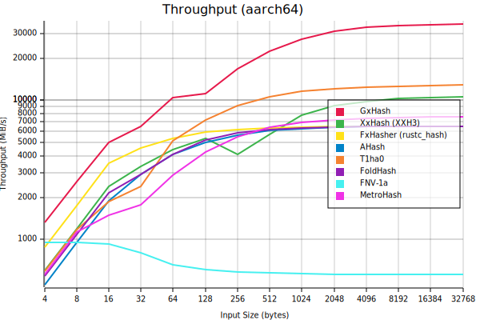

# GxHash

[](https://github.com/ogxd/gxhash/actions/workflows/build_test.yml)

* [Usage](#usage)
* [Features](#features)
  * [Blazingly Fast 🚀](#blazingly-fast-)
  * [Highly Robust 🗿](#highly-robust-)
* [Convenience Aliases](#convenience-aliases)
* [Portability](#portability)
  * [Supported Architectures](#supported-architectures)
  * [Stability of Hashes](#stability-of-hashes)
* [Security](#security)
  * [DOS Resistance](#dos-resistance)
  * [Multicollisions Resistance](#multicollisions-resistance)
  * [Cryptographic Properties](#cryptographic-properties)
* [Benchmarks](#benchmarks)
* [Contributing](#contributing)
* [Publication](#publication)

<!-- cargo-rdme start -->

A [blazingly fast](#blazingly-fast-) and [robust](#highly-robust-) non-cryptographic hashing algorithm.

## Usage

Directly as a hash function:

```rust
let bytes: &[u8] = "hello world".as_bytes();
let seed = 1234;

println!(" 32-bit hash: {:x}", gxhash::gxhash32(&bytes, seed));
println!(" 64-bit hash: {:x}", gxhash::gxhash64(&bytes, seed));
println!("128-bit hash: {:x}", gxhash::gxhash128(&bytes, seed));
```

GxHash provides an implementation of the [`Hasher`](core::hash::Hasher) trait.
To construct a `HashMap` using `GxHasher` as its hasher:

```rust
use gxhash::{GxHasher, RandomState};
use std::collections::HashMap;

let mut map: HashMap<&str, i32, RandomState> = HashMap::default();
map.insert("answer", 42);
```

## Features

### Blazingly Fast 🚀

As of this writing, GxHash is the fastest, non-cryptographic hashing algorithm of its class, for all input sizes. This performance is possible foremost due
to heavy usage of SIMD intrinsics, high ILP construction and a small bytecode (easily inlined and cached).

See the [benchmarks](https://github.com/ogxd/gxhash#benchmarks).

### Highly Robust 🗿

GxHash uses several rounds of hardware-accelerated AES block cipher for efficient bit mixing.
Thanks to this, GxHash passes all [SMHasher](https://github.com/rurban/smhasher) tests, which is the de facto quality benchmark for non-cryptographic hash
functions, gathering most of the existing algorithms. GxHash has low collisions, uniform distribution and high avalanche properties.

Check out the [paper](https://github.com/ogxd/gxhash/blob/main/article/article.pdf) for more technical details.

## Convenience Aliases

For interop with existing crates which require a `std::collection::HashMap` ,
the type aliases `HashMap`, `HashSet` are provided.

```rust
use gxhash::{HashMap, HashMapExt};

let mut map: HashMap<&str, i32> = HashMap::new();
map.insert("answer", 42);
```

Note the import of `HashMapExt`. This is needed for the constructor.

## Portability

### Supported Architectures

GxHash is compatible with:

* X86 processors with `AES-NI` intrinsics
* ARM processors with `NEON` intrinsics

> **⚠️ Warning**
>
> Other platforms are currently not supported (there is no fallback). Currently the crate does not build on these. If you add support for a new platform,
> a PR is highly welcome.

### Stability of Hashes

All generated hashes for a given version of GxHash are stable. This means that for a given input the output hash will be the same across all supported
platforms.

*An exception to this is the AVX2 version of GxHash (requires a `nightly` toolchain).*

## Security

### DOS Resistance

GxHash is a seeded hashing algorithm, meaning that depending on the seed used, it will generate completely different hashes. The default `HasherBuilder`
(`GxHasherBuilder::default()`) uses seed randomization, making any `HashMap`/`HashSet` more DOS resistant, as it will make it much more difficult for
attackers to be able to predict which hashes may collide without knowing the seed used. This does not mean however that it is completely DOS resistant.
This has to be analyzed further.

### Multicollisions Resistance

GxHash uses a 128-bit internal state (and even 256-bit with the `avx2` feature). This makes GxHash
[a widepipe construction](https://en.wikipedia.org/wiki/Merkle%E2%80%93Damg%C3%A5rd_construction#Wide_pipe_construction) when generating hashes of size
64-bit or smaller. Which, among other useful properties, are inherently more resistant to multicollision attacks. See
[this paper](https://www.iacr.org/archive/crypto2004/31520306/multicollisions.pdf) for more details.

### Cryptographic Properties

GxHash is a non-cryptographic hashing algorithm, thus it is not recommended to use it as a cryptographic algorithm (it is e.g. not a replacement for SHA).
It has not been assessed if GxHash is preimage resistant and how difficult it is to be reversed.

<!-- cargo-rdme end -->

## Benchmarks

To run the benchmarks locally do one of the following:

```bash
# Benchmark throughput
cargo bench --bench throughput
# Benchmark performance of GxHash's Hasher when used in a HashSet
cargo bench --bench hashset
# Benchmark throughput and get output as a markdown table
cargo bench --bench throughput --features bench-md
# Benchmark throughput and get output as .svg plots
cargo bench --bench throughput --features bench-plot
```

GxHash is continuously benchmarked on X86 and ARM Github runners.
[](https://github.com/ogxd/gxhash/actions/workflows/bench.yml)

**Lastest Benchmark Results:**



## Contributing

* Feel free to submit PRs
* Repository is entirely usable via `cargo` commands
* Versioning is the following
  * Major for stability breaking changes (output hashes for a same input are different after changes)
  * Minor for API changes/removal
  * Patch for new APIs, bug fixes and performance improvements

> **🛈** [`cargo-asm`](https://github.com/gnzlbg/cargo-asm) is an easy way to view the actual generated assembly code (`cargo asm gxhash::gxhash::gxhash64`).
> *Note that `#[inline]` should be removed; otherwise the resp. method won't be seen by the tool.*

> **🛈** [AMD μProf](https://www.amd.com/en/developer/uprof.html) gives some useful insights on per-instruction time spent.

## Publication

*Author's note:*

> I'm committed to the open dissemination of scientific knowledge. In an era where access to information is more democratized than ever, I believe that science should be freely available to all – both for consumption and contribution. Traditional scientific journals often involve significant financial costs, which can introduce biases and can shift the focus from purely scientific endeavors to what is currently trendy.
>
> To counter this trend and to uphold the true spirit of research, I have chosen to share my work on "gxhash" directly on GitHub, ensuring that it's openly accessible to anyone interested. Additionally, the use of a free Zenodo DOI ensures that this research is citable and can be referenced in other works, just as traditional publications are.
>
> I strongly believe in a world where science is not behind paywalls, and I am in for a more inclusive, unbiased, and open scientific community.

Publication:
[PDF](https://github.com/ogxd/gxhash-rust/blob/main/article/article.pdf)

Cite this publication/algorithm:
[](https://zenodo.org/badge/latestdoi/690754256)
